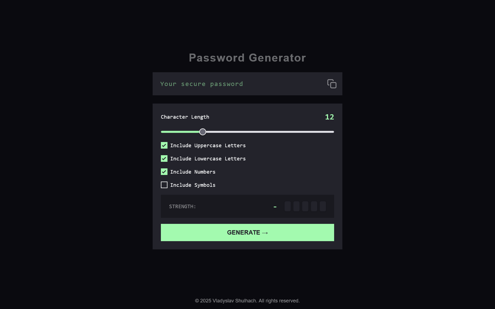
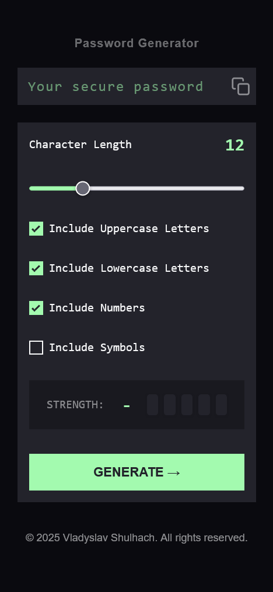

# Frontend Mentor - Password Generator App

## Live Demo

[View the live app here](https://password-generator-app-main-bji8i6q8j.vercel.app/)

## Table of contents

- [Overview](#overview)
  - [Features](#features)
  - [Screenshots](#screenshots)
- [Getting Started](#getting-started)
- [Author](#author)

## Overview

A modern, accessible password generator built with React and SCSS. Easily generate strong, customizable passwords and check their strength in real time.

## Features

- Generate a password based on selected inclusion options (uppercase, lowercase, numbers, symbols)
- Copy the generated password to the clipboard
- See a strength rating for the generated password
- Responsive layout for all device sizes
- Accessible: keyboard navigation, aria-live, input validation
- Visual feedback for hover and focus states

## Screenshots

### Desktop



### Mobile



## Getting Started

1. Clone the repository:
   ```bash
   git clone https://github.com/vladyslav-shulhach/password-generator-app-main.git
   cd password-generator-app
   ```
2. Install dependencies:
   ```bash
   npm install
   ```
3. Start the development server:
   ```bash
   npm start
   ```
4. Open [http://localhost:3000](http://localhost:3000) to view the app.

### Built With

- Semantic HTML5 markup
- SCSS (Sass) with BEM and modular structure
- CSS custom properties
- Flexbox & CSS Grid
- Mobile-first workflow
- React
- Accessibility best practices

## Author

- [Vladyslav Shulhach](https://github.com/Vladyslav-Shulhach)
